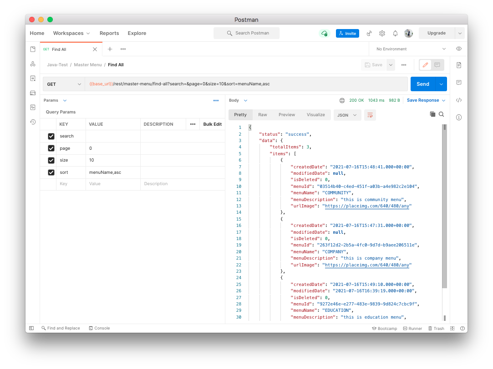
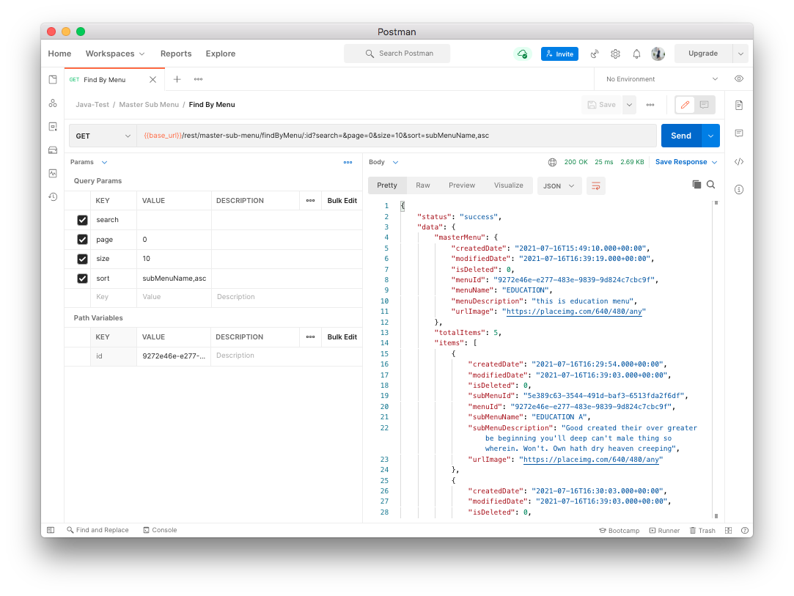
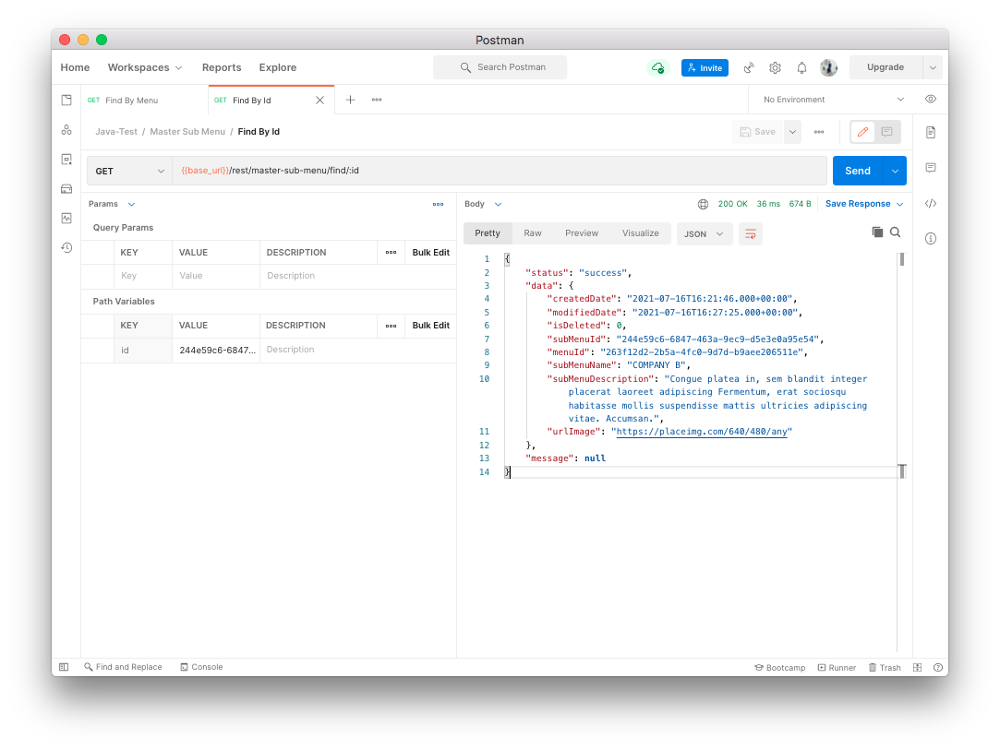

# Demo project for Java API - Hands On
### java-api-services

## Environment
* Database MySQL : [Download](src/main/resources/assets/java-api-test.sql)
* Postman Collection : [Download](src/main/resources/assets/Java-Test.postman_collection.json)

## 📁 Postman Collection
### 🔸  Master Menu 
**End-point: Find All / Method: GET**
>```
>{{base_url}}/rest/master-menu/find-all?search=&page=0&size=10&sort=menuName,asc
>```
Query Params
|Param|value|
|---|---|
|search||
|page|0|
|size|10|
|sort|menuName,asc|

⁃ ⁃ ⁃ ⁃ ⁃ ⁃ ⁃ ⁃ ⁃ ⁃ ⁃ ⁃ ⁃ ⁃ ⁃ ⁃ ⁃ ⁃ ⁃ ⁃ ⁃ ⁃ ⁃ ⁃ ⁃ ⁃ ⁃ ⁃ ⁃ ⁃ ⁃ ⁃ ⁃ ⁃ ⁃ ⁃ ⁃ ⁃ ⁃ ⁃ ⁃ ⁃ ⁃ ⁃ ⁃ ⁃ ⁃
 \
**End-point: Find By Id / Method: GET**
>```
>{{base_url}}/rest/master-menu/find/:id
>```
⁃ ⁃ ⁃ ⁃ ⁃ ⁃ ⁃ ⁃ ⁃ ⁃ ⁃ ⁃ ⁃ ⁃ ⁃ ⁃ ⁃ ⁃ ⁃ ⁃ ⁃ ⁃ ⁃ ⁃ ⁃ ⁃ ⁃ ⁃ ⁃ ⁃ ⁃ ⁃ ⁃ ⁃ ⁃ ⁃ ⁃ ⁃ ⁃ ⁃ ⁃ ⁃ ⁃ ⁃ ⁃ ⁃ ⁃
 \
**End-point: Save / Method: POST**
>```
>{{base_url}}/rest/master-menu/save
>```
*Body (**raw**)*

```json
{
    "menuName": "EDUCATION",
    "menuDescription": "this is education menu",
    "urlImage": "https://placeimg.com/640/480/any"
}
```
⁃ ⁃ ⁃ ⁃ ⁃ ⁃ ⁃ ⁃ ⁃ ⁃ ⁃ ⁃ ⁃ ⁃ ⁃ ⁃ ⁃ ⁃ ⁃ ⁃ ⁃ ⁃ ⁃ ⁃ ⁃ ⁃ ⁃ ⁃ ⁃ ⁃ ⁃ ⁃ ⁃ ⁃ ⁃ ⁃ ⁃ ⁃ ⁃ ⁃ ⁃ ⁃ ⁃ ⁃ ⁃ ⁃ ⁃
 \
**End-point: Update / Method: PUT**
Method: PUT
>```
>{{base_url}}/rest/master-menu/update/:id
>```
*Body (**raw**)*

```json
{
    "menuName": "EDUCATION MENU",
    "menuDescription": "this is education menu",
    "urlImage": "https://placeimg.com/640/480/any"
}
```
⁃ ⁃ ⁃ ⁃ ⁃ ⁃ ⁃ ⁃ ⁃ ⁃ ⁃ ⁃ ⁃ ⁃ ⁃ ⁃ ⁃ ⁃ ⁃ ⁃ ⁃ ⁃ ⁃ ⁃ ⁃ ⁃ ⁃ ⁃ ⁃ ⁃ ⁃ ⁃ ⁃ ⁃ ⁃ ⁃ ⁃ ⁃ ⁃ ⁃ ⁃ ⁃ ⁃ ⁃ ⁃ ⁃ ⁃
 \
**End-point: Delete / Method: DELETE**
>```
>{{base_url}}/rest/master-menu/delete/:id
>```
⁃ ⁃ ⁃ ⁃ ⁃ ⁃ ⁃ ⁃ ⁃ ⁃ ⁃ ⁃ ⁃ ⁃ ⁃ ⁃ ⁃ ⁃ ⁃ ⁃ ⁃ ⁃ ⁃ ⁃ ⁃ ⁃ ⁃ ⁃ ⁃ ⁃ ⁃ ⁃ ⁃ ⁃ ⁃ ⁃ ⁃ ⁃ ⁃ ⁃ ⁃ ⁃ ⁃ ⁃ ⁃ ⁃ ⁃


### 🔸  Master Sub Menu 
**End-point: Find All / Method: GET**
>```
>{{base_url}}/rest/master-sub-menu/find-all?search=&page=0&size=10&sort=subMenuName,asc
>```
Query Params
|Param|value|
|---|---|
|search||
|page|0|
|size|10|
|sort|subMenuName,asc|

⁃ ⁃ ⁃ ⁃ ⁃ ⁃ ⁃ ⁃ ⁃ ⁃ ⁃ ⁃ ⁃ ⁃ ⁃ ⁃ ⁃ ⁃ ⁃ ⁃ ⁃ ⁃ ⁃ ⁃ ⁃ ⁃ ⁃ ⁃ ⁃ ⁃ ⁃ ⁃ ⁃ ⁃ ⁃ ⁃ ⁃ ⁃ ⁃ ⁃ ⁃ ⁃ ⁃ ⁃ ⁃ ⁃ ⁃
 \
**End-point: Find By Menu / Method: GET**
>```
>{{base_url}}/rest/master-sub-menu/findByMenu/:id?search=&page=0&size=10&sort=subMenuName,asc
>```
Query Params
|Param|value|
|---|---|
|search||
|page|0|
|size|10|
|sort|subMenuName,asc|

⁃ ⁃ ⁃ ⁃ ⁃ ⁃ ⁃ ⁃ ⁃ ⁃ ⁃ ⁃ ⁃ ⁃ ⁃ ⁃ ⁃ ⁃ ⁃ ⁃ ⁃ ⁃ ⁃ ⁃ ⁃ ⁃ ⁃ ⁃ ⁃ ⁃ ⁃ ⁃ ⁃ ⁃ ⁃ ⁃ ⁃ ⁃ ⁃ ⁃ ⁃ ⁃ ⁃ ⁃ ⁃ ⁃ ⁃
 \
**End-point: Find By Id / Method: GET**
>```
>{{base_url}}/rest/master-sub-menu/find/:id
>```
⁃ ⁃ ⁃ ⁃ ⁃ ⁃ ⁃ ⁃ ⁃ ⁃ ⁃ ⁃ ⁃ ⁃ ⁃ ⁃ ⁃ ⁃ ⁃ ⁃ ⁃ ⁃ ⁃ ⁃ ⁃ ⁃ ⁃ ⁃ ⁃ ⁃ ⁃ ⁃ ⁃ ⁃ ⁃ ⁃ ⁃ ⁃ ⁃ ⁃ ⁃ ⁃ ⁃ ⁃ ⁃ ⁃ ⁃
 \
**End-point: Save / Method: POST**
>```
>{{base_url}}/rest/master-sub-menu/save
>```
*Body (**raw**)*

```json
{
    "menuId": "03514b40-c4ed-451f-a03b-a4e982c2e104",
    "subMenuName": "COMMUNITY E",
    "subMenuDescription": "Libero eros. Tempor non lorem Non. Elementum vehicula netus risus massa et ante rhoncus ipsum, sociis sollicitudin quisque tempor cursus.",
    "urlImage": "https://placeimg.com/640/480/any"
}
```
⁃ ⁃ ⁃ ⁃ ⁃ ⁃ ⁃ ⁃ ⁃ ⁃ ⁃ ⁃ ⁃ ⁃ ⁃ ⁃ ⁃ ⁃ ⁃ ⁃ ⁃ ⁃ ⁃ ⁃ ⁃ ⁃ ⁃ ⁃ ⁃ ⁃ ⁃ ⁃ ⁃ ⁃ ⁃ ⁃ ⁃ ⁃ ⁃ ⁃ ⁃ ⁃ ⁃ ⁃ ⁃ ⁃ ⁃
 \
**End-point: Update / Method: PUT**
>```
>{{base_url}}/rest/master-sub-menu/update/:id
>```
*Body (**raw**)*
```json
{
    "menuId": "263f12d2-2b5a-4fc0-9d7d-b9aee206511e",
    "subMenuName": "COMPANY B",
    "subMenuDescription": "Congue platea in, sem blandit integer placerat laoreet adipiscing Fermentum, erat sociosqu habitasse mollis suspendisse mattis ultricies adipiscing vitae. Accumsan.",
    "urlImage": "https://placeimg.com/640/480/any"
}
```
⁃ ⁃ ⁃ ⁃ ⁃ ⁃ ⁃ ⁃ ⁃ ⁃ ⁃ ⁃ ⁃ ⁃ ⁃ ⁃ ⁃ ⁃ ⁃ ⁃ ⁃ ⁃ ⁃ ⁃ ⁃ ⁃ ⁃ ⁃ ⁃ ⁃ ⁃ ⁃ ⁃ ⁃ ⁃ ⁃ ⁃ ⁃ ⁃ ⁃ ⁃ ⁃ ⁃ ⁃ ⁃ ⁃ ⁃
 \

**End-point: Delete / Method: DELETE**
>```
>{{base_url}}/rest/master-sub-menu/delete/:id
>```
⁃ ⁃ ⁃ ⁃ ⁃ ⁃ ⁃ ⁃ ⁃ ⁃ ⁃ ⁃ ⁃ ⁃ ⁃ ⁃ ⁃ ⁃ ⁃ ⁃ ⁃ ⁃ ⁃ ⁃ ⁃ ⁃ ⁃ ⁃ ⁃ ⁃ ⁃ ⁃ ⁃ ⁃ ⁃ ⁃ ⁃ ⁃ ⁃ ⁃ ⁃ ⁃ ⁃ ⁃ ⁃ ⁃ ⁃


## Screenshots
  
 \

 \

